<h1 align="center">
  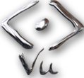
</h1>

 Status <☕>Finalizado<☕/> 2007 - 2014 

# Portfólio de Layouts

## Clientes da Vu3D:

<!-- 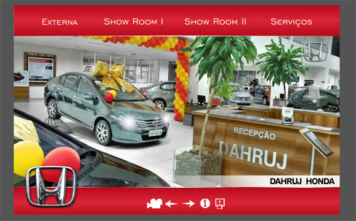 -->

<h4 align="left">
Dahruj Honda Campinas
</h4>

<h4 align="left">
Concorde Renault Campinas
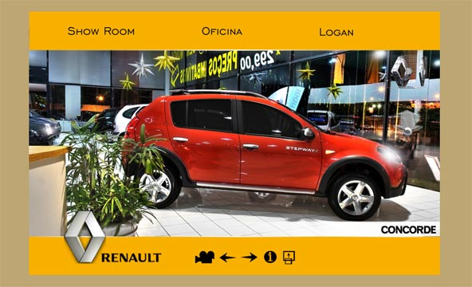
</h4>

<h4 align="center">
Concorde Nissan Campinas
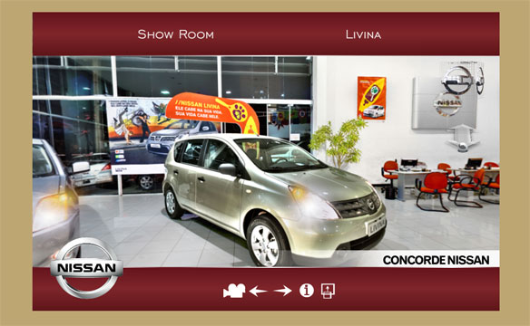
</h4>
<h4 align="center">
Studio Motors Kawasaki Campinas
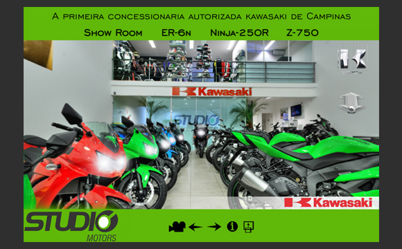
</h4>
<h4 align="center">
Innovare Virtual São Paulo
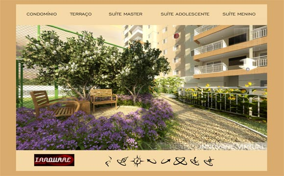
</h4>
<h4 align="center">
Loja Japonesa Pedreira
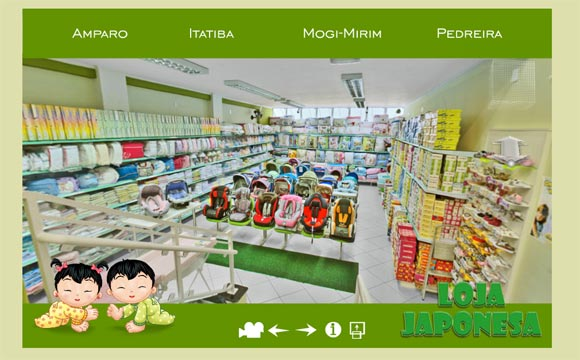
</h4>
<h4 align="center">
FAJ Campus II Jaguariúna
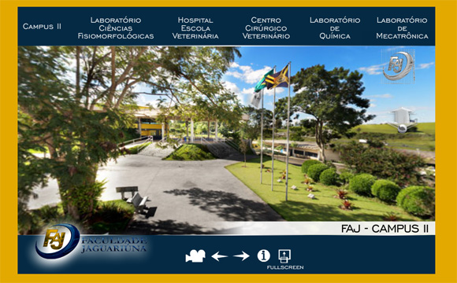
</h4>
<h4 align="center">
Parque dos Lagos Jaguariúna
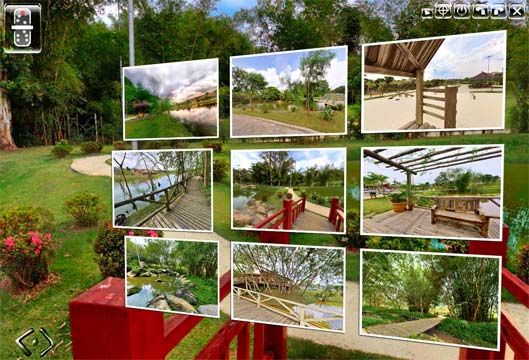
</h4>
<h4 align="center">
Center Louças Pedreira
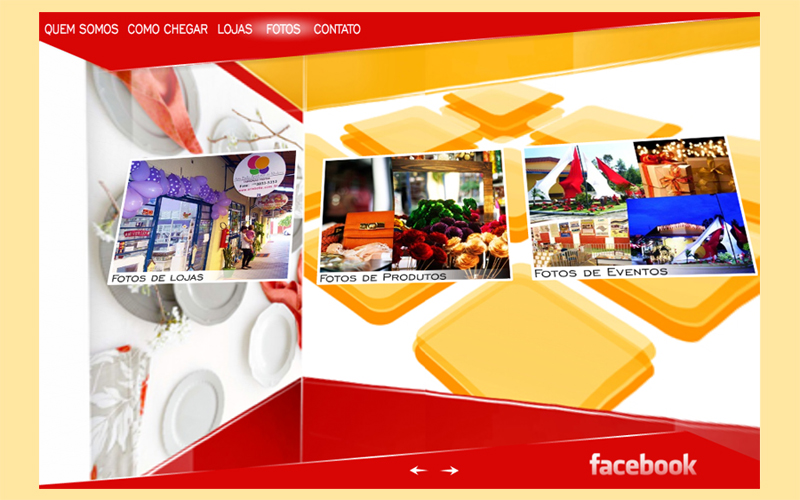
</h4>

## Sobre Nós:

<h1 align="center">
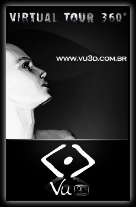
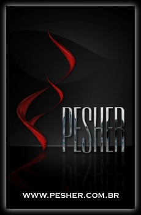
</h1>

<h4 align="center">Pesher
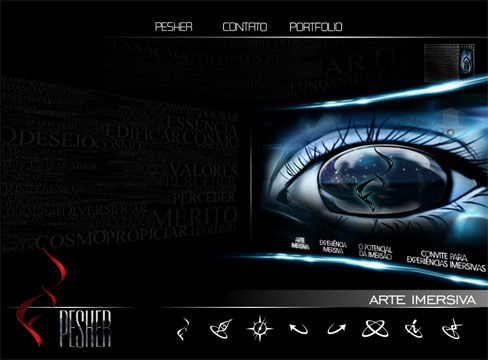
</h4>

## A Equipe:

- Scrum Master: Rudney Isayas Santos
- UX/UI Designer: Claudia Valois
- Web Developer: Debh Valois
- Photo Edition: Queila Valois

<h1 align="center">
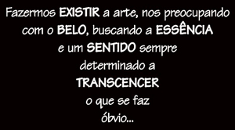
</h1>

## Virtualização:

Sites institucionais imersivos | Sites de alto impacto integrado em ambientes tridimensionais | Virtual Tour 360º | Realidade Ampliada | Experience Marketing | Fotografia Panorâmica | Skin Personalizado.

<h1 align="center">
  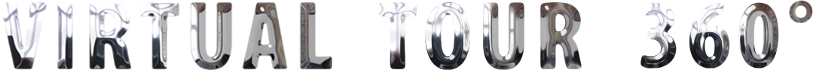
</h1>

## Tecnologias:

ActionScript 3.0 | Adobe Flash CS4 | HTML | CSS | XML/SWF | JavaScript | Scripts SQL | Blender 3D & Libspark | Adobe Photoshop CS4 | PTEditor & PTEditor | Adobe AfterEffects.

<h1 align="center">
  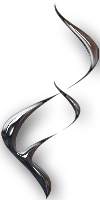
</h1>

## :octocat: A Autora: 

<table>
  <tr>
    <td align="center">
      <a href="#">
         
        
          <b>Debh Valois</b>
        
      </a>
    </td>
  </tr>
</table>

